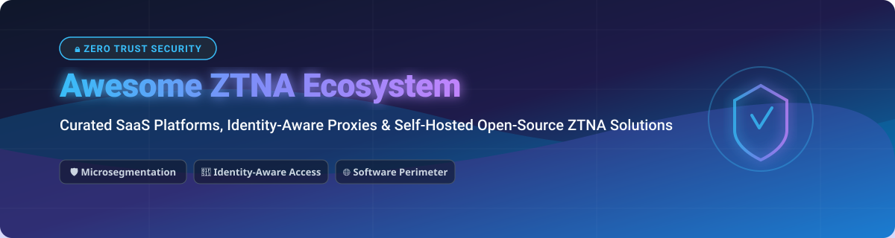

  

# 🛡️ Awesome Zero Trust Network Access (ZTNA) 🚀

  
  
  
  

## 🌐 Top Zero Trust Network Access (ZTNA) Ecosystem & Software-Defined Perimeter Tools

> **A Curated Directory of Commercial SaaS Platforms & Self-Hosted Open-Source GitHub Projects**  
> *Focused on Identity-Aware Access Proxies, Microsegmentation, Secure Remote Access & BeyondCorp Security Architectures.*  
> **📅 Last updated: October 2026**

---

### 📖 SEO & Overview
**Zero Trust Network Access (ZTNA)** solutions replace legacy corporate VPNs with identity-centric, least-privilege access proxies. By enforcing continuous verification ("never trust, always verify"), ZTNA prevents lateral network movement and protects internal infrastructure, databases, Kubernetes clusters, and microservices across cloud and multi-cloud environments.

---

## 📑 Table of Contents
- [📊 Market Overview & Sector Analysis](#-market-overview--sector-analysis)
- [☁️ SaaS / Commercial Hosted Platforms](#️-saas--commercial-hosted-platforms)
- [🔓 Open-Source GitHub Projects](#-open-source-github-projects)
- [🛠️ Frameworks & Architecture Guide](#️-frameworks--architecture-guide)
- [🤝 How to Contribute](#-how-to-contribute)
- [☕ Support & Sponsorship](#-support--sponsorship)
- [⭐ Star History](#-star-history)
- [⚠️ Disclaimer](#️-disclaimer)

---

## 📊 Market Overview & Sector Analysis

> 💡 **Sector Market Size & Dynamics**:  
> The global Zero Trust Network Access (ZTNA) market is estimated at **$1.6B to $47.5B+ (2026)** (expanding up to **$65.6B+** when integrated within broader SASE and Security Service Edge solutions) growing at a **22% CAGR**.  
>  
> **Market Structure**: **Moderately Fragmented with Active Enterprise Consolidation**. While hyper-scale cloud vendors (AWS) and cybersecurity giants (Cisco, Palo Alto Networks, Zscaler) dominate enterprise contracts, high-growth specialized vendors (Tailscale, Cloudflare, Netskope) retain strong market share. The sector exhibits consolidation toward unified SASE platforms while remaining open to developer-centric innovations.

---

## ☁️ SaaS / Commercial Hosted Platforms

*Sorted by Company Revenue / Valuation (Descending)*

| 🏢 Platform | 📝 Description | 💰 Pricing | 🎁 Free Tier Limit | 📈 Size (Revenue / Valuation) |
| :--- | :--- | :--- | :--- | :--- |
| **[AWS Verified Access](https://aws.amazon.com/verified-access/)** ⚡ | AWS's ZTNA service providing identity-aware application access without VPN. Native IAM, SSO & device trust integration. | $0.27 per application hour + $0.02 per GB processed (US East baseline) | No free tier; pay-as-you-go based on hourly usage | **~$716.9 Billion** Revenue (AWS/Amazon Parent) |
| **[Cisco Secure Access](https://www.cisco.com/)** 🔒 | Cisco's SSE platform with ZTNA, secure web gateway (SWG), and cloud access security broker (CASB). | Enterprise quote-based (50 user minimum contract baseline) | No free forever plan; up to 100-seat evaluation trial available | **~$63.3 Billion** Revenue (~$431.6B Market Cap) |
| **[Palo Alto Prisma Access](https://www.paloaltonetworks.com/prisma/access)** 🛡️ | Comprehensive SASE platform with ZTNA, SWG, and cloud firewall capabilities for Palo Alto ecosystems. | Enterprise quote-based (~$120/user/year ZTNA tier; ~200 seat minimum) | No free tier; evaluation PoC via sales representative | **~$11.5 Billion** Revenue (~$324.7B Market Cap) |
| **[Zscaler Private Access](https://www.zscaler.com/products/zscaler-private-access)** 🚀 | Market-leading ZTNA platform providing zero trust access to private apps with cloud-native architecture. | Enterprise quote-based (~$140 - $375/user/year; 50-seat minimum block) | No free forever plan; 7-day hosted test drive / PoC available | **~$3.35 Billion** Revenue (~$32.0B Market Cap) |
| **[Cloudflare Access](https://www.cloudflare.com/zero-trust/products/access/)** 🌐 | Identity-aware access to self-hosted and SaaS applications within Cloudflare Zero Trust global edge network. | $7.00 per user/month (Pay-as-you-go tier) | **Free forever for up to 50 users** (24h log retention, community support) | **~$2.17 Billion** Revenue (~$121.5B Market Cap) |
| **[Netskope Private Access](https://www.netskope.com/)** 🛡️ | ZTNA within Netskope's SSE platform offering private app access with data protection and DLP integration. | Enterprise quote-based (~$9 - $14/user/month in SSE bundle) | No free forever plan; 14-day hosted Test Drive available | **~$845 Million** ARR (~$7.2B Market Cap / IPO) |
| **[Tailscale](https://tailscale.com/)** 🔑 | Mesh VPN based on WireGuard providing identity-aware networking with ACLs, MagicDNS, and SSO integration. | $8.00 per user/month (Standard plan, monthly/annual) | **Free forever for personal use** (up to 6 users & unlimited devices) | **~$1.5 Billion** Valuation (~$45.2M ARR) |
| **[Perimeter 81](https://www.perimeter81.com/)** (Check Point) 🌐 | ZTNA platform with cloud private networking and secure remote access (now Check Point Harmony SASE). | $8.00 per user/month (Essentials plan; 10 user minimum) | No free trial; 30-day money-back guarantee | **~$1.0 Billion** Valuation (Acquired by Check Point) |
| **[Twingate](https://www.twingate.com/)** ⚡ | Modern ZTNA for developers featuring simple setup, identity-based access, and zero network changes. | $5.00 per user/month (Teams plan, billed annually) | **Free forever Starter plan** (up to 5 users, 1 admin, 10 remote networks) | **~$400 Million** Valuation (~$12.6M ARR) |
| **[Appgate SDP](https://www.appgate.com/)** 🔐 | Software-defined perimeter with dynamic, identity-centric access controls for hybrid infrastructure. | Enterprise quote-based (custom deployment & user pricing) | No free forever plan; 30-day free trial available | Private (~$45.3 Million Revenue) |

---

## 🔓 Open-Source GitHub Projects

*Sorted by GitHub Star Count (Descending)*

- **[Keycloak](https://github.com/keycloak/keycloak)**   
  🔑 **Open-source identity and access management (IAM)**, Apache-2.0 licensed. Provides SSO, OAuth2/OIDC, User Federation, and fine-grained authorization for ZTNA proxies.

- **[Teleport](https://github.com/gravitational/teleport)**   
  🛡️ **Identity-based access for infrastructure**, Apache-2.0 licensed. Access SSH, Kubernetes, databases, and internal web apps with short-lived X.509 certificates and zero static credentials.

- **[WireGuard](https://github.com/WireGuard/wireguard-linux)**   
  ⚡ **The modern VPN protocol underlying most ZTNA solutions**, GPL-2.0 licensed. Kernel-level performance with state-of-the-art cryptography.

- **[NetBird](https://github.com/netbirdio/netbird)**   
  🚀 **Open-source zero trust networking platform**, Apache-2.0 licensed. WireGuard-based peer-to-peer overlay network with SSO identity provider integration and self-hosted admin dashboard.

- **[Authelia](https://github.com/authelia/authelia)**   
  🔒 **Open-source authentication and authorization server**, Apache-2.0 licensed. Delivers 2FA, 1FA proxy authentication, and single sign-on (SSO) for reverse proxies like Traefik & NGINX.

- **[Authentik](https://github.com/goauthentik/authentik)**   
  🌐 **Open-source identity provider**, MIT licensed. Built for security teams with forward auth, proxy integration, SAML, and OAuth2 support.

- **[Headscale](https://github.com/juanfont/headscale)**   
  🎛️ **Self-hosted Tailscale control server**, BSD-3-Clause licensed. Open-source implementation of Tailscale's coordination server for full control plane ownership.

- **[Netmaker](https://github.com/gravitl/netmaker)**   
  🕸️ **WireGuard-based zero trust virtual networking platform**, Apache-2.0 licensed. Generates flat, fast overlay networks connecting cross-cloud and edge nodes.

- **[BunkerWeb](https://github.com/bunkerity/bunkerweb)**   
  🛡️ **Next-generation web application firewall (WAF) with ZTNA capabilities**, AGPL-3.0 licensed. Combines WAF security with identity-aware access protection.

- **[Casbin](https://github.com/casbin/casbin)**   
  📜 **Open-source authorization library**, Apache-2.0 licensed. Supports ACL, RBAC, and ABAC access control models across multiple programming languages.

- **[Ockam](https://github.com/build-trust/ockam)**   
  🔐 **End-to-end encrypted messaging & zero trust connectivity**, Apache-2.0 licensed. Suite of tools for mutual authentication and encrypted application-layer tunnels.

- **[OpenZiti](https://github.com/openziti/ziti)**   
  ⚡ **The leading programmable zero trust networking platform**, Apache-2.0 licensed. Embeddable zero trust SDKs (Go, Java, Python, Node.js, C, Swift) for direct app-level ZTNA without network changes.

- **[Pomerium](https://github.com/pomerium/pomerium)**   
  Proxy **Identity-aware access proxy (IAP) for zero trust**, Apache-2.0 licensed. BeyondCorp-style HTTP access proxy with seamless SSO integration (Okta, Azure AD, Google).

- **[Pritunl Zero](https://github.com/pritunl/pritunl-zero)**   
  🛡️ **Open-source BeyondCorp zero trust server**, Apache-2.0 licensed. Secures SSH and internal web applications with Okta, Auth0, Google Workspace, and Azure AD integration.

- **[wg-access-server](https://github.com/Place1/wg-access-server)**   
  🌐 **All-in-one WireGuard VPN with Web UI**, MIT licensed. Simple device management and Web UI access server.

---

### 🛠️ Frameworks & Architecture Guide
To build a self-hosted Zero Trust architecture:
1. **Identity & Authentication**: Deploy **Keycloak**, **Authentik**, or **Authelia** for IdP and OIDC/SAML single sign-on.
2. **Access Proxy & Web Apps**: Layer **Pomerium** or **BunkerWeb** in front of HTTP endpoints for identity-aware session validation.
3. **Infrastructure & SSH/K8s**: Deploy **Teleport** or **Pritunl Zero** for certificate-based infrastructure controls.
4. **Mesh Network / Overlay**: Interconnect workloads using **OpenZiti**, **NetBird**, **Headscale**, or **Netmaker**.

---

## 🤝 How to Contribute

1. Fork the repo. 🍴
2. Add/edit entries in `README.md` (follow existing format). ✍️
3. Include: name, link, concise description, pricing/star metrics. 📝
4. Submit a Pull Request with a clear summary. 🚀

---

## ☕ Support & Sponsorship

If you find this curated Zero Trust ecosystem resource helpful, please consider starring the repository and supporting further open-source security curation! ⭐

- 💖 **Sponsor on GitHub**: [https://github.com/sponsors/ishandutta2007](https://github.com/sponsors/ishandutta2007)
- 🌟 **Star the Repository**: Click the star button at the top right of this page!
- 📢 **Share with your Security Team**: Help spread zero trust awareness on Twitter, LinkedIn, and Discord.

---

## ⭐ Star History

---

## ⚠️ Disclaimer

- This is a **community-curated list** — not exhaustive and not a commercial endorsement.
- ZTNA platforms control access to sensitive production applications and infrastructure. Self-hosted solutions require proper security hardening, key management, and identity provider integration.
- **ZTNA is not a silver bullet** — it must be combined with endpoint protection (EDR), data loss prevention (DLP), and monitoring for complete zero trust architecture.

---

  <b>Made with ❤️ for security engineers, network architects, and zero trust practitioners.</b>

